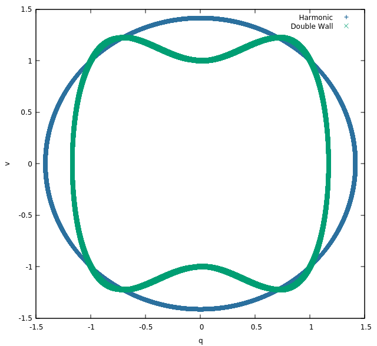

# h: Classical harmonic model propagated by velocity Verlet.

## What?

My classical harmonic model toy, which could actually use two  model potentials: \
harmonic:

<p align="center">


</p>

double wall:

<p align="center">


</p>

## Why?

I'm boring so I wrote this piece of shit.

## Compile

```shell
$ ./make.sh
```

This will generate two executables, `h` and `d` under your directory, which uses the harmonic potential and the double wall potential, correspondingly.

## Run

```shell
$ ./h [Nsteps] [outputfreq]
```
```shell
$ ./d [Nsteps] [outputfreq]
```

## Example

```shell
$ ./h 10000000 500 > log_h
$ ./d 10000000 500 > log_d
$ gnuplot
gnuplot> set xlabel "q"
gnuplot> set ylabel "v"
gnuplot> p "log_h" u 2:3 title "Harmonic", "log_d" u 2:3 title "Double Wall"
```

<p align="center">
   
</p>

## Hack

- To change parameters of the potential function and the initial conditions, modify values in the `main` function.
- To use the Langevin thermostat[<sup>1</sup>](#ref-1), uncomment the commented `thermostat_lan` sentences in the `vv2` function.

## References

<div id="ref-1"></div>

- [1] Giovanni Bussi and Michele Parrinello. Accurate sampling using langevin dynamics. Physical Review E, 75(5):056707, 2007.
